# 数据库开发-MySQL

## 1. 数据库设计-DDL


### 1.1 项目开发流程


需求文档：

- 在我们开发一个项目或者项目当中的某个模块之前，会先会拿到产品经理给我们提供的页面原型及需求文档。

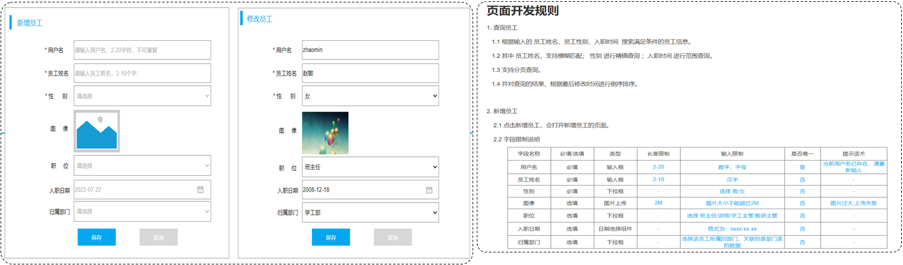

设计：

- 拿到产品原型和需求文档之后，我们首先要做的不是编码，而是要先进行项目的设计，其中就包括概要设计、详细设计、接口设计、数据库设计等等。
- 数据库设计根据产品原型以及需求文档，要分析各个模块涉及到的表结构以及表结构之间的关系，以及表结构的详细信息。最终我们需要将数据库以及数据库当中的表结构设计创建出来。

开发/测试：

- 参照页面原型和需求进行编码，实现业务功能。在这个过程当中，我们就需要来操作设计出来的数据库表结构，来完成业务的增删改查操作等。

部署上线：

- 在项目的功能开发测试完成之后，项目就可以上线运行了，后期如果项目遇到性能瓶颈，还需要对项目进行优化。优化很重要的一个部分就是数据库的优化，包括数据库当中索引的建立、SQL 的优化、分库分表等操作。


在上述的流程当中，针对于数据库来说，主要包括三个阶段：

1. 数据库设计阶段
   - 参照页面原型以及需求文档设计数据库表结构
2. 数据库操作阶段
   - 根据业务功能的实现，编写SQL语句对数据表中的数据进行增删改查操作
3. 数据库优化阶段
   - 通过数据库的优化来提高数据库的访问性能。优化手段：索引、SQL优化、分库分表等

接下来我们就先来学习第一部分数据库的设计，而数据库的设计就是来定义数据库，定义表结构以及表中的字段。


### 1.2 数据库操作

我们在进行数据库设计，需要使用到刚才所介绍SQL分类中的DDL语句。

DDL英文全称是Data Definition Language(数据定义语言)，用来定义数据库对象(数据库、表)。

DDL中数据库的常见操作：查询、创建、使用、删除。

#### 1.2.1 查询数据库

**查询所有数据库：**

```mysql
show databases;
```

命令行中执行效果如下：

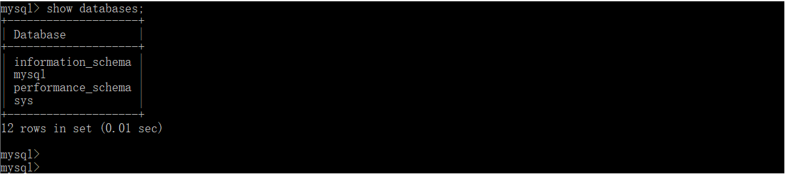 

**查询当前数据库：**

```mysql
select database();
```

命令行中执行效果如果：

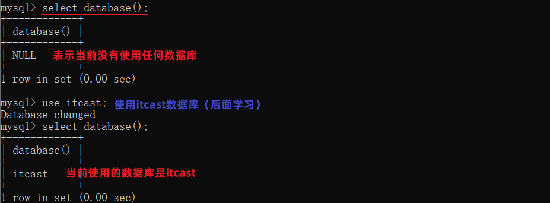

> 我们要操作某一个数据库，必须要切换到对应的数据库中。 
>
> 通过指令：select  database() ，就可以查询到当前所处的数据库 


#### 1.2.2 创建数据库

**语法：**

```mysql
create database [ if not exists ] 数据库名;
```

案例： 创建一个itcast数据库。

```mysql
create database itcast;
```

命令行执行效果如下：

 

==注意：在同一个数据库服务器中，不能创建两个名称相同的数据库，否则将会报错。==


- 可以使用if not exists来避免这个问题

```sql
-- 数据库不存在,则创建该数据库；如果存在则不创建
create database if not extists itcast; 
```

 命令行执行效果如下：  


#### 1.2.3 使用数据库

**语法：**

```mysql
use 数据库名 ;
```

> 我们要操作某一个数据库下的表时，就需要通过该指令，切换到对应的数据库下，否则不能操作。

案例：切换到itcast数据

```mysql
use itcast;
```

命令执行效果如下：

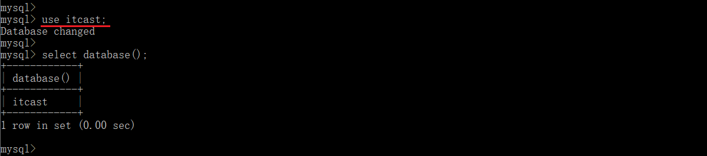 


#### 1.2.4 删除数据库

**语法：**

```mysql
drop database [ if exists ] 数据库名 ;
```

> 如果删除一个不存在的数据库，将会报错。
>
> 可以加上参数 if exists ，如果数据库存在，再执行删除，否则不执行删除。

案例：删除itcast数据库

~~~mysql
drop database if exists itcast; -- itcast数据库存在时删除
~~~

命令执行效果如下：

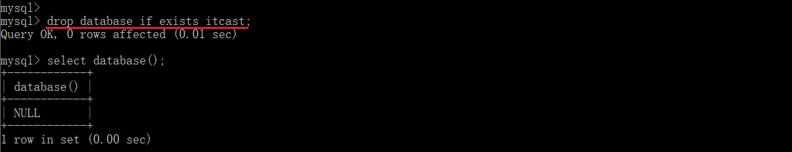 

> 说明：上述语法中的database，也可以替换成 schema
>
> - 如：create schema db01;
> - 如：show schemas;
>
> 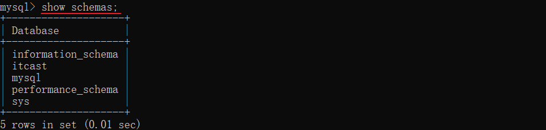


### 1.3 图形化工具

#### 1.3.1 介绍

前面DDL中关于数据库操作的SQL语句，在我们编写这些SQL时，都是在命令行当中完成的。在命令行当中来敲这些SQL语句很不方便，主要的原因有以下 3 点：

1. 没有任何代码提示。（全靠记忆，容易敲错字母造成执行报错）
2. 操作繁琐，影响开发效率。（所有的功能操作都是通过SQL语句来完成的）
3. 编写过的SQL代码无法保存。

在项目开发当中，通常为了提高开发效率，都会借助于现成的图形化管理工具来操作数据库。

目前MySQL主流的图形化界面工具有以下几种：


DataGrip是JetBrains旗下的一款数据库管理工具，是管理和开发MySQL、Oracle、PostgreSQL的理想解决方案。

官网： https://www.jetbrains.com/zh-cn/datagrip/


#### 1.3.2 安装

安装： 参考资料中提供的《DataGrip安装手册》

> 说明：DataGrip这款工具可以不用安装，因为Jetbrains公司已经将DataGrip这款工具的功能已经集成到了 IDEA当中，所以我们就可以使用IDEA来作为一款图形化界面工具来操作Mysql数据库。


#### 1.3.3 使用

##### 1.2.3.1 连接数据库

1、打开IDEA自带的Database

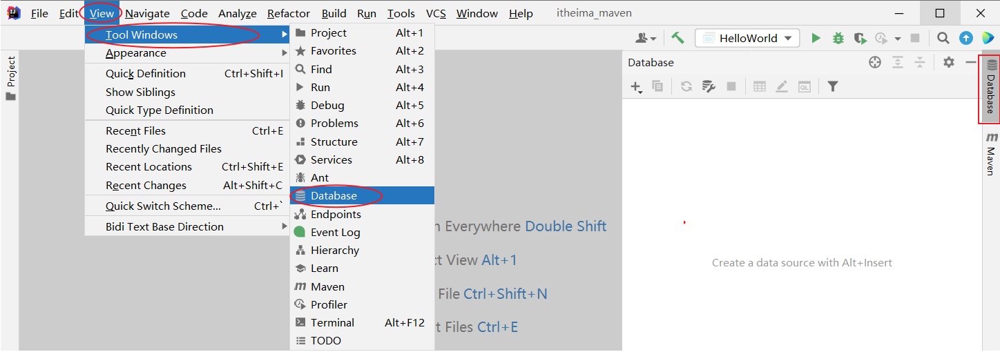


2、配置MySQL

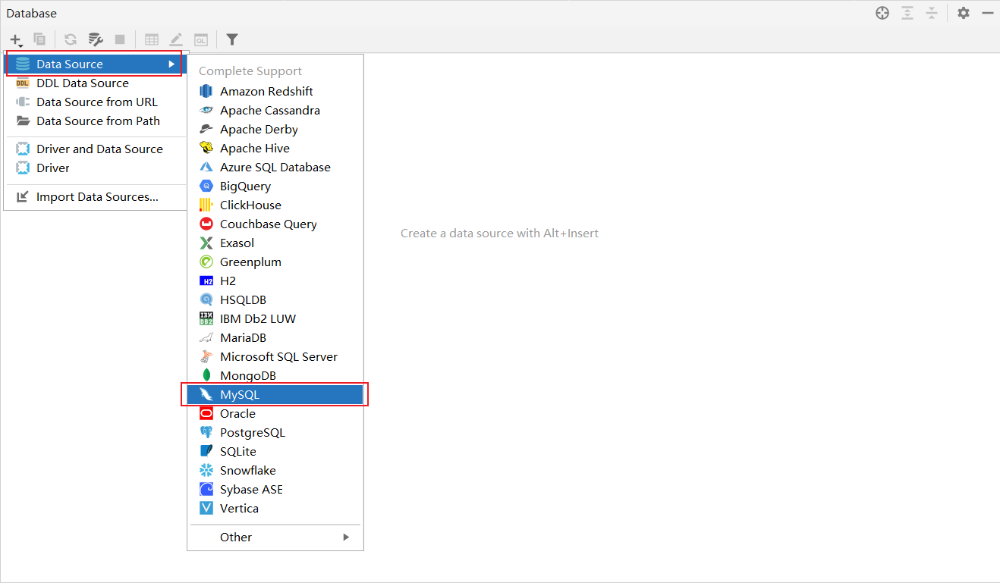


3、输入相关信息

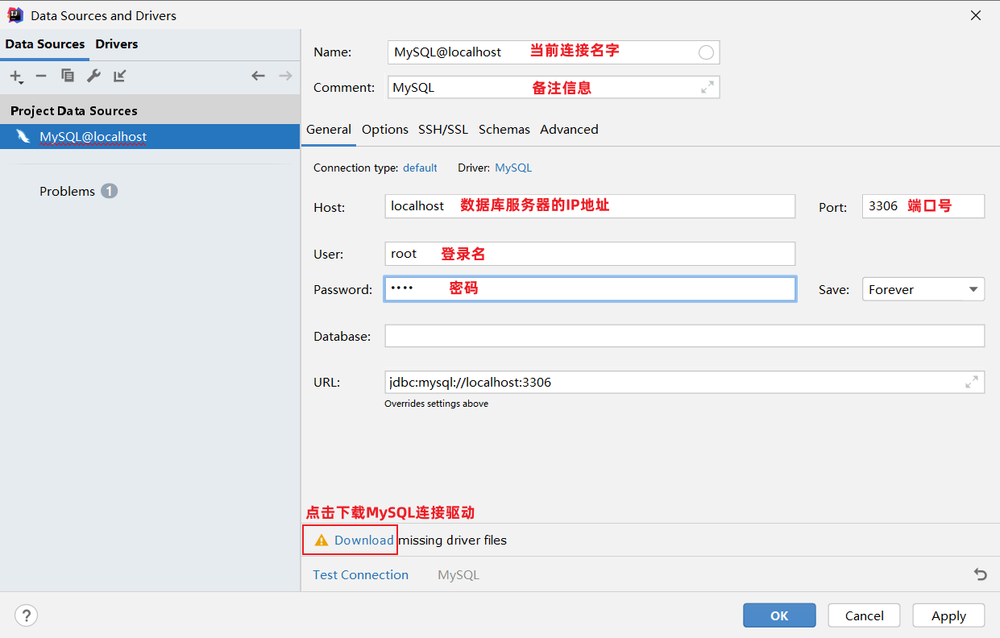 


4、下载MySQL连接驱动

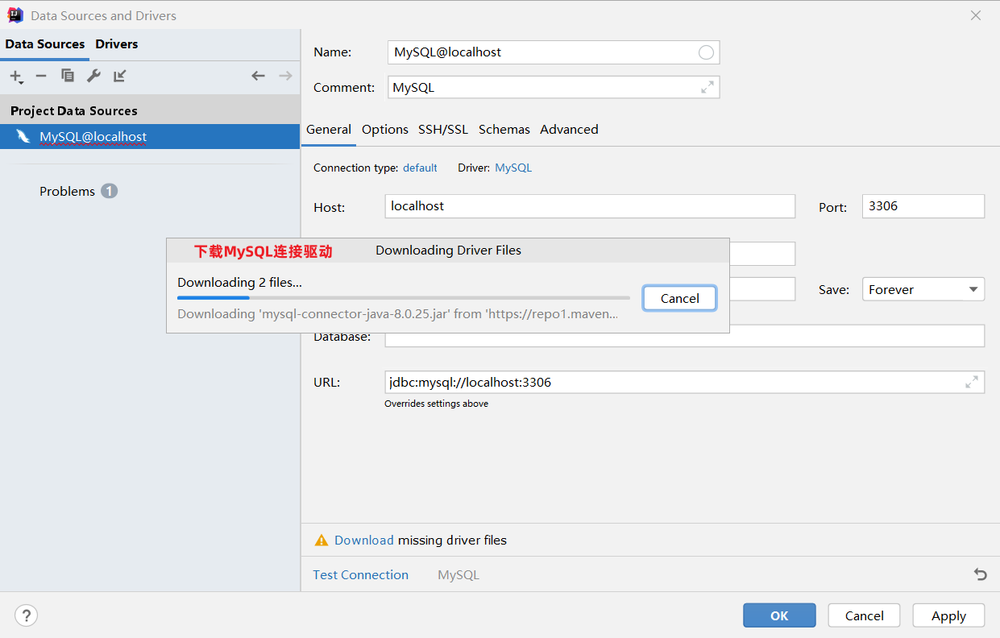


5、测试数据库连接

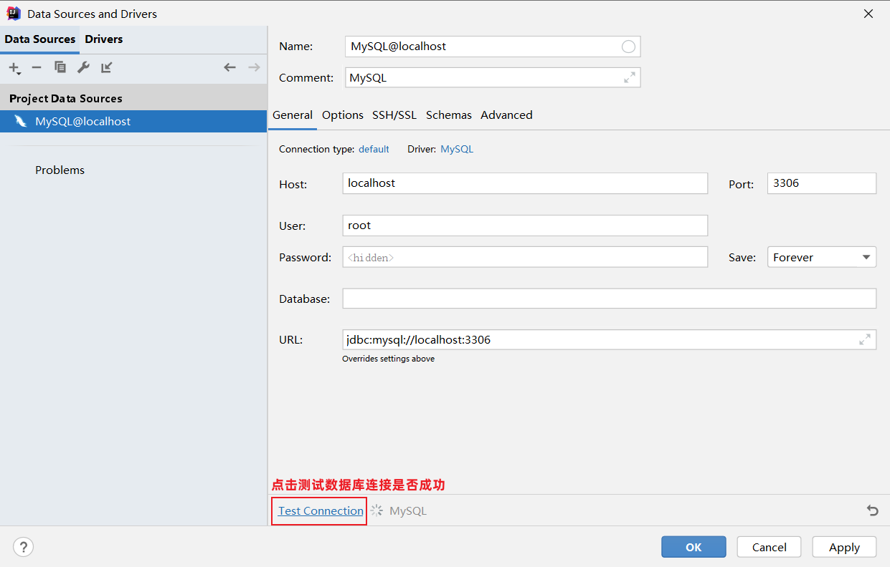


6、保存配置

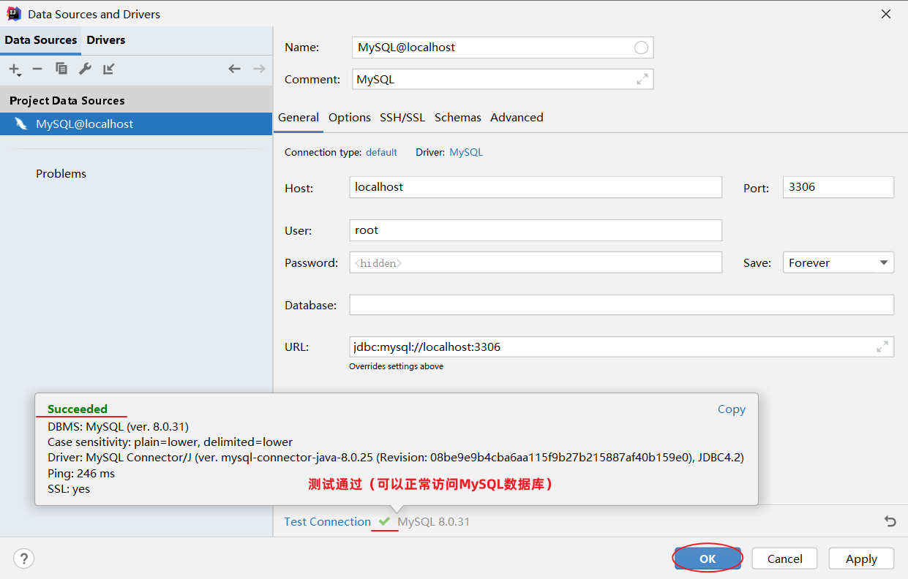


默认情况下，连接上了MySQL数据库之后， 数据库并没有全部展示出来。 需要选择要展示哪些数据库。具体操作如下：

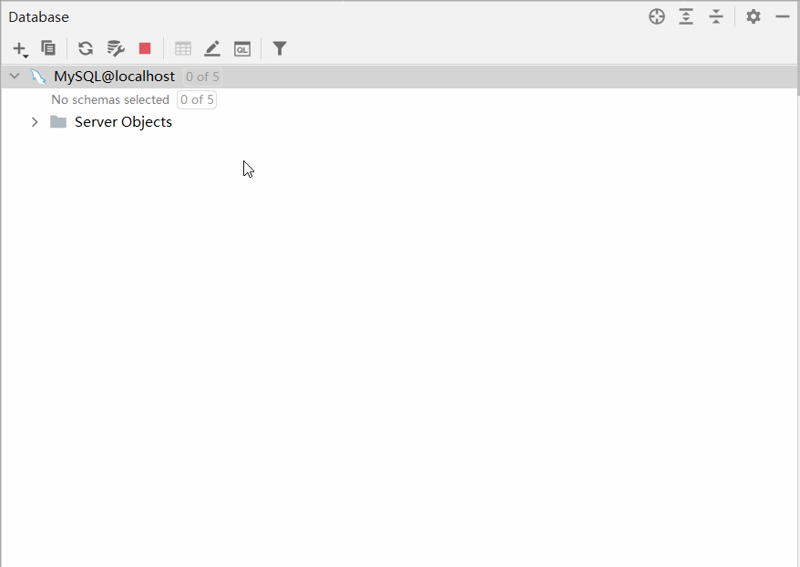


##### 1.2.3.2 操作数据库

**创建数据库：**

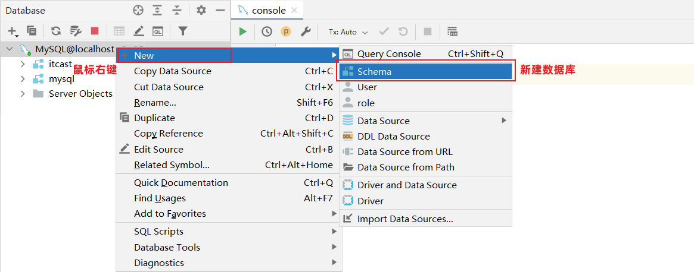

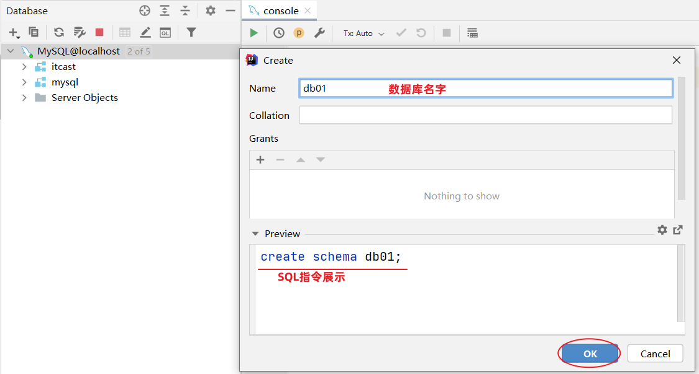

> 有了图形化界面工具后，就可以方便的使用图形化工具：创建数据库，创建表、修改表等DDL操作。
>
> 其实工具底层也是通过DDL语句操作的数据库，只不过这些SQL语句是图形化界面工具帮我们自动完成的。


**查看所有数据库：**

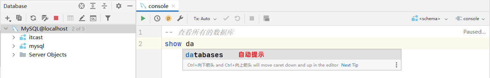

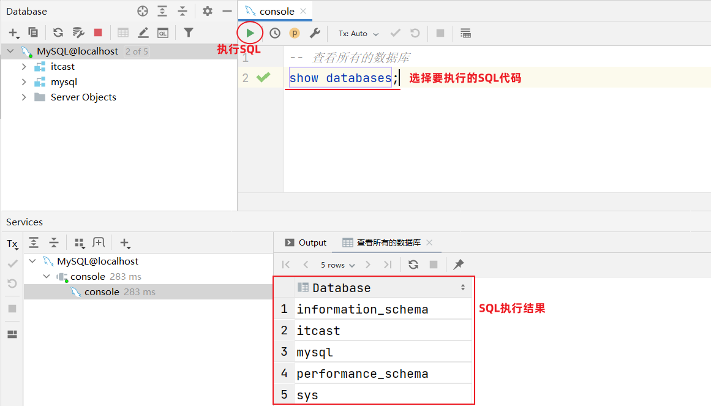


### 1.4 表操作

学习完了DDL语句当中关于数据库的操作之后，接下来我们继续学习DDL语句当中关于表结构的操作。

关于表结构的操作也是包含四个部分：创建表、查询表、修改表、删除表。

#### 1.3.1 创建

##### 1.3.1.1 语法

```mysql
create table  表名(
	字段1  字段1类型 [约束]  [comment  字段1注释 ],
	字段2  字段2类型 [约束]  [comment  字段2注释 ],
	......
	字段n  字段n类型 [约束]  [comment  字段n注释 ] 
) [ comment  表注释 ] ;
```

> 注意： [ ] 中的内容为可选参数； 最后一个字段后面没有逗号


案例：创建tb_user表

- 对应的结构如下：

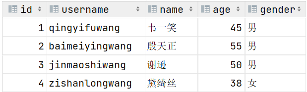  

- 建表语句： 

```mysql
create table tb_user (
    id int comment 'ID,唯一标识',   # id是一行数据的唯一标识（不能重复）
    username varchar(20) comment '用户名',
    name varchar(10) comment '姓名',
    age int comment '年龄',
    gender char(1) comment '性别'
) comment '用户表';
```

> 数据表创建完成，接下来我们还需要测试一下是否可以往这张表结构当中来存储数据。

双击打开tb_user表结构，大家会发现里面没有数据：

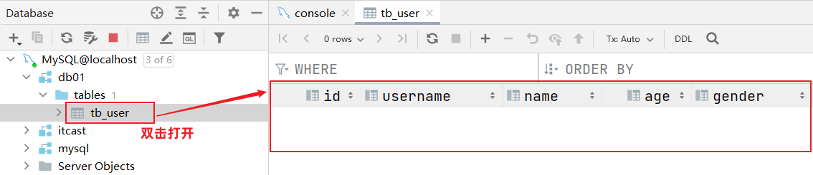

添加数据：

 

此时我们再插入一条数据：

 

我们之前提到过：id字段是一行数据的唯一标识，不能有重复值。但是现在数据表中有两个相同的id值，这是为什么呢？

- 其实我们现在创建表结构的时候， id这个字段我们只加了一个备注信息说明它是一个唯一标识，但是在数据库层面呢，并没有去限制字段存储的数据。所以id这个字段没有起到唯一标识的作用。

> 想要限制字段所存储的数据，就需要用到数据库中的约束。


##### 1.3.1.2 约束

概念：所谓约束就是作用在表中字段上的规则，用于限制存储在表中的数据。

作用：就是来保证数据库当中数据的正确性、有效性和完整性。（后面的学习会验证这些）

在MySQL数据库当中，提供了以下5种约束：

| **约束** | **描述**                                         | **关键字**  |
| -------- | ------------------------------------------------ | ----------- |
| 非空约束 | 限制该字段值不能为null                           | not null    |
| 唯一约束 | 保证字段的所有数据都是唯一、不重复的             | unique      |
| 主键约束 | 主键是一行数据的唯一标识，要求非空且唯一         | primary key |
| 默认约束 | 保存数据时，如果未指定该字段值，则采用默认值     | default     |
| 外键约束 | 让两张表的数据建立连接，保证数据的一致性和完整性 | foreign key |

> 注意：约束是作用于表中字段上的，可以在创建表/修改表的时候添加约束。


案例：创建tb_user表

- 对应的结构如下：

 

> 在上述的表结构中:
>
> - id 是一行数据的唯一标识
>
> - username 用户名字段是非空且唯一的
>
> - name 姓名字段是不允许存储空值的
>
> - gender 性别字段是有默认值，默认为男

- 建表语句： 

```mysql
create table tb_user (
    id int primary key comment 'ID,唯一标识', 
    username varchar(20) not null unique comment '用户名',
    name varchar(10) not null comment '姓名',
    age int comment '年龄',
    gender char(1) default '男' comment '性别'
) comment '用户表';
```

> 数据表创建完成，接下来测试一下表中字段上的约束是否生效

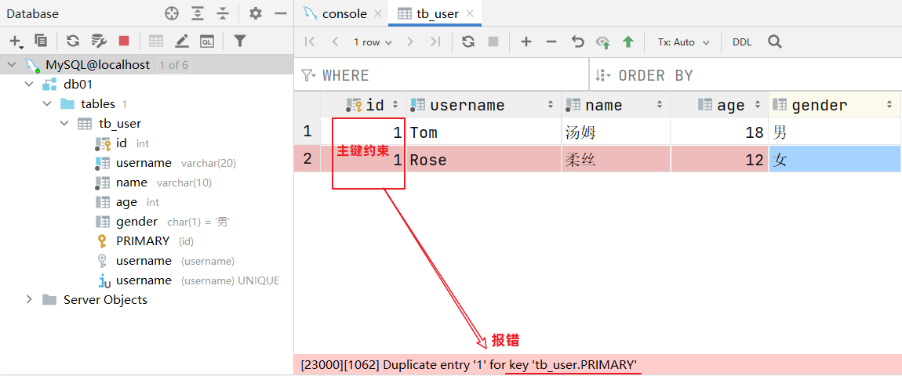

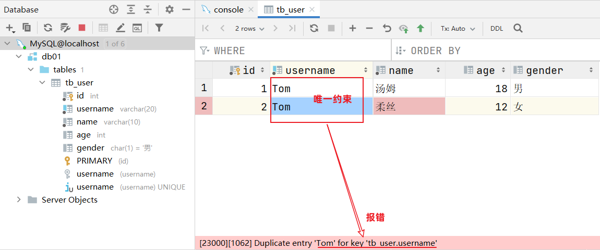


大家有没有发现一个问题：id字段下存储的值，如果由我们自己来维护会比较麻烦(必须保证值的唯一性)。MySQL数据库为了解决这个问题，给我们提供了一个关键字：auto_increment（自动增长）

> 主键自增：auto_increment
>
> - 每次插入新的行记录时，数据库自动生成id字段(主键)下的值
> - 具有auto_increment的数据列是一个正数序列开始增长(从1开始自增)

~~~mysql
create table tb_user (
    id int primary key auto_increment comment 'ID,唯一标识', #主键自动增长
    username varchar(20) not null unique comment '用户名',
    name varchar(10) not null comment '姓名',
    age int comment '年龄',
    gender char(1) default '男' comment '性别'
) comment '用户表';
~~~

测试：主键自增

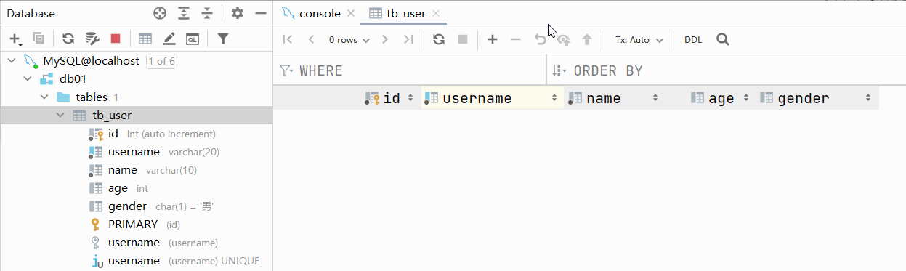


##### 1.3.1.3 数据类型

在上面建表语句中，我们在指定字段的数据类型时，用到了int 、varchar、char，那么在MySQL中除了以上的数据类型，还有哪些常见的数据类型呢？ 接下来,我们就来详细介绍一下MySQL的数据类型。

MySQL中的数据类型有很多，主要分为三类：数值类型、字符串类型、日期时间类型。

**数值类型**

| 类型        | 大小   | 有符号(SIGNED)范围                                    | 无符号(UNSIGNED)范围                                       | 描述               |
| ----------- | ------ | ----------------------------------------------------- | ---------------------------------------------------------- | ------------------ |
| TINYINT     | 1byte  | (-128，127)                                           | (0，255)                                                   | 小整数值           |
| SMALLINT    | 2bytes | (-32768，32767)                                       | (0，65535)                                                 | 大整数值           |
| MEDIUMINT   | 3bytes | (-8388608，8388607)                                   | (0，16777215)                                              | 大整数值           |
| INT/INTEGER | 4bytes | (-2147483648，2147483647)                             | (0，4294967295)                                            | 大整数值           |
| BIGINT      | 8bytes | (-2^63，2^63-1)                                       | (0，2^64-1)                                                | 极大整数值         |
| FLOAT       | 4bytes | (-3.402823466 E+38，3.402823466351 E+38)              | 0 和 (1.175494351  E-38，3.402823466 E+38)                 | 单精度浮点数值     |
| DOUBLE      | 8bytes | (-1.7976931348623157 E+308，1.7976931348623157 E+308) | 0 和  (2.2250738585072014 E-308，1.7976931348623157 E+308) | 双精度浮点数值     |
| DECIMAL     |        | 依赖于M(精度)和D(标度)的值                            | 依赖于M(精度)和D(标度)的值                                 | 小数值(精确定点数) |

```sql
示例: 
    年龄字段 ---不会出现负数, 而且人的年龄不会太大
	age tinyint unsigned
	
	分数 ---总分100分, 最多出现一位小数
	score double(4,1)
```

**字符串类型**

| 类型       | 大小                  | 描述                         |
| ---------- | --------------------- | ---------------------------- |
| CHAR       | 0-255 bytes           | 定长字符串(需要指定长度)     |
| VARCHAR    | 0-65535 bytes         | 变长字符串(需要指定长度)     |
| TINYBLOB   | 0-255 bytes           | 不超过255个字符的二进制数据  |
| TINYTEXT   | 0-255 bytes           | 短文本字符串                 |
| BLOB       | 0-65 535 bytes        | 二进制形式的长文本数据       |
| TEXT       | 0-65 535 bytes        | 长文本数据                   |
| MEDIUMBLOB | 0-16 777 215 bytes    | 二进制形式的中等长度文本数据 |
| MEDIUMTEXT | 0-16 777 215 bytes    | 中等长度文本数据             |
| LONGBLOB   | 0-4 294 967 295 bytes | 二进制形式的极大文本数据     |
| LONGTEXT   | 0-4 294 967 295 bytes | 极大文本数据                 |

char 与 varchar 都可以描述字符串，char是定长字符串，指定长度多长，就占用多少个字符，和字段值的长度无关 。而varchar是变长字符串，指定的长度为最大占用长度 。相对来说，char的性能会更高些。

```sql
示例： 
    用户名 username ---长度不定, 最长不会超过50
	username varchar(50)
	
	手机号 phone ---固定长度为11
	phone char(11)
```

**日期时间类型**

| 类型      | 大小 | 范围                                       | 格式                | 描述                     |
| --------- | ---- | ------------------------------------------ | ------------------- | ------------------------ |
| DATE      | 3    | 1000-01-01 至  9999-12-31                  | YYYY-MM-DD          | 日期值                   |
| TIME      | 3    | -838:59:59 至  838:59:59                   | HH:MM:SS            | 时间值或持续时间         |
| YEAR      | 1    | 1901 至 2155                               | YYYY                | 年份值                   |
| DATETIME  | 8    | 1000-01-01 00:00:00 至 9999-12-31 23:59:59 | YYYY-MM-DD HH:MM:SS | 混合日期和时间值         |
| TIMESTAMP | 4    | 1970-01-01 00:00:01 至 2038-01-19 03:14:07 | YYYY-MM-DD HH:MM:SS | 混合日期和时间值，时间戳 |

```sql
示例: 
	生日字段  birthday ---生日只需要年月日  
	birthday date
	
	创建时间 createtime --- 需要精确到时分秒
	createtime  datetime
```


##### 1.3.1.4 案例

需求：根据产品原型/需求创建表((设计合理的数据类型、长度、约束) 

> 参考资料中提供的《黑马-tlias智能学习辅助系统》页面原型，设计员工管理模块的表结构
>
> 暂不考虑所属部门字段


产品原型及需求如下：

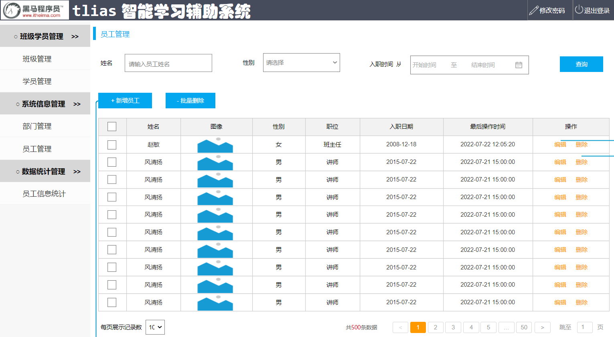

 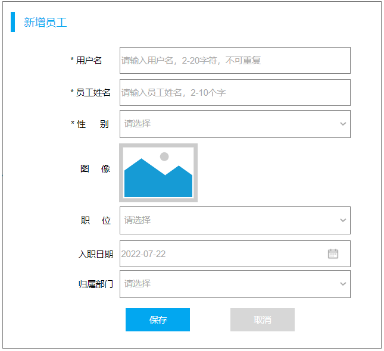

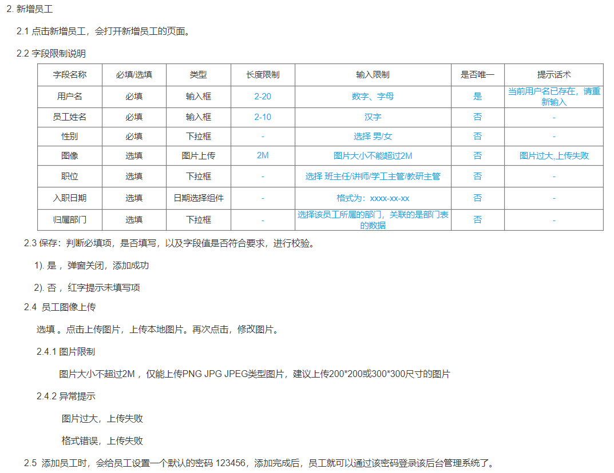

**步骤：**

1. 阅读产品原型及需求文档，看看里面涉及到哪些字段。

2. 查看需求文档说明，确认各个字段的类型以及字段存储数据的长度限制。

3. 在页面原型中描述的基础字段的基础上，再增加额外的基础字段。

使用SQL创建表：

```sql
create table emp (
  id int unsigned primary key auto_increment comment 'ID',
  username varchar(20) not null unique comment '用户名',
  password varchar(32) default '123456' comment '密码',
  name varchar(10) not null comment '姓名',
  gender tinyint unsigned not null comment '性别, 说明: 1 男, 2 女',
  image varchar(300) comment '图像',
  job tinyint unsigned comment '职位, 说明: 1 班主任,2 讲师, 3 学工主管, 4 教研主管',
  entrydate date comment '入职时间',
  create_time datetime not null comment '创建时间',
  update_time datetime not null comment '修改时间'
) comment '员工表';
```

除了使用SQL语句创建表外，我们还可以借助于图形化界面来创建表结构，这种创建方式会更加直观、更加方便。

操作步骤如下：

1. 在指定操作的数据库上，右键New ==> Table

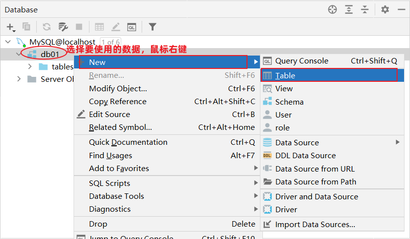

2. 编辑表结构的相关信息

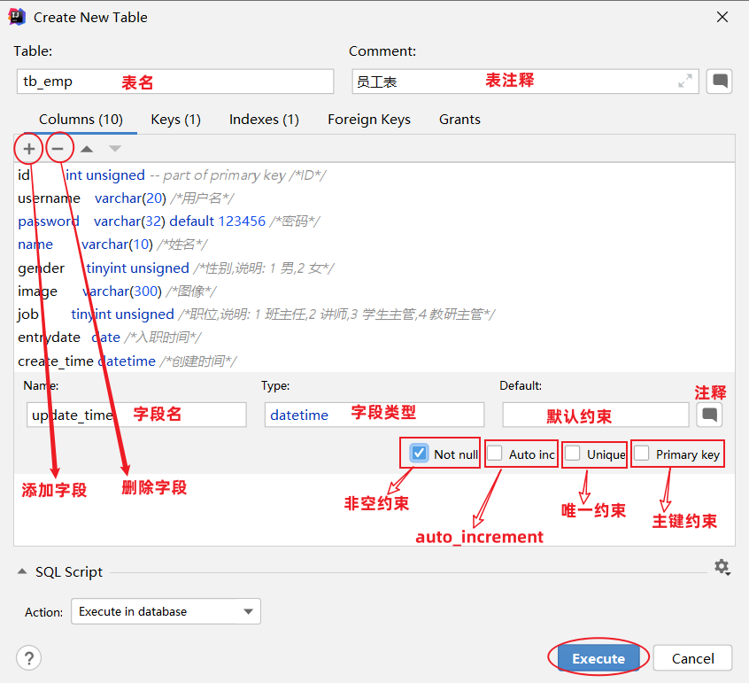


##### 1.3.1.5 设计表流程

通过上面的案例，我们明白了，设计一张表，基本的流程如下：

1. 阅读页面原型及需求文档

2. 基于页面原则和需求文档，确定原型字段(类型、长度限制、约束)

3. 再增加表设计所需要的业务基础字段(id主键、插入时间、修改时间)

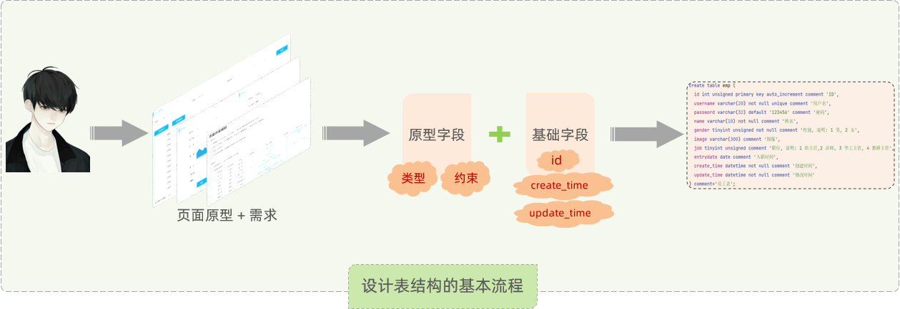

> 说明：
>
> - create_time：记录的是当前这条数据插入的时间。 
>
> - update_time：记录当前这条数据最后更新的时间。


#### 1.3.2 查询

> 关于表结构的查询操作，工作中一般都是直接基于**图形化界面操作**。 

**查询当前数据库所有表**

```mysql
show tables;
```

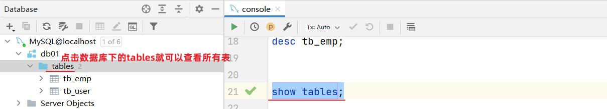

**查看指定表结构**

```mysql
desc 表名 ;#可以查看指定表的字段、字段的类型、是否可以为NULL、是否存在默认值等信息
```

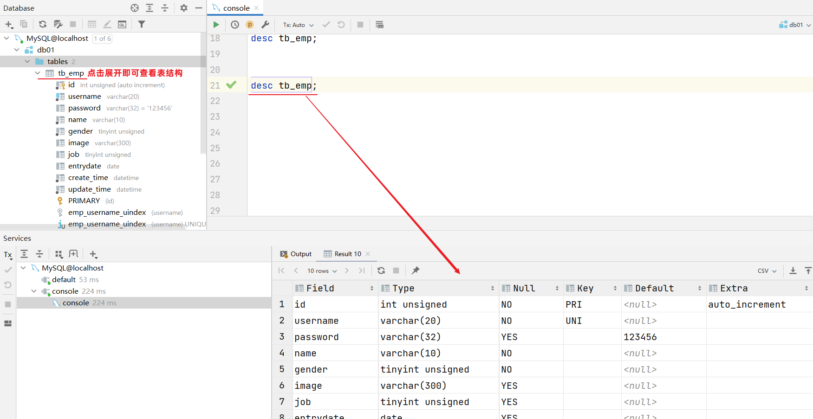

**查询指定表的建表语句**

```mysql
show create table 表名 ;
```

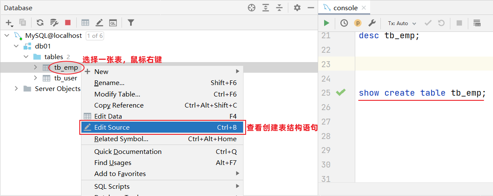

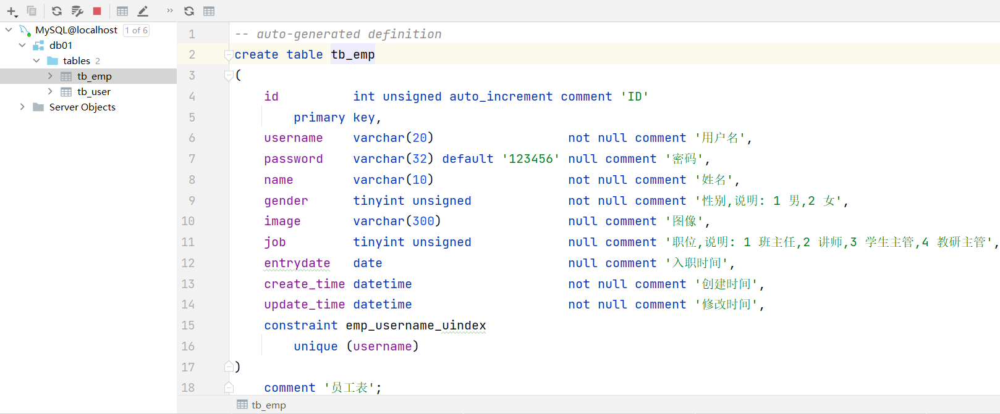


#### 1.3.3 修改

> 关于表结构的修改操作，工作中一般都是直接基于**图形化界面操作**。 

**添加字段**

```sql
alter table 表名 add  字段名  类型(长度)  [comment 注释]  [约束];
```

案例： 为tb_emp表添加字段qq，字段类型为 varchar(11)

```sql
alter table tb_emp add  qq  varchar(11) comment 'QQ号码';
```

> 图形化操作：添加字段

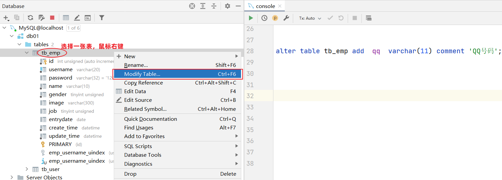

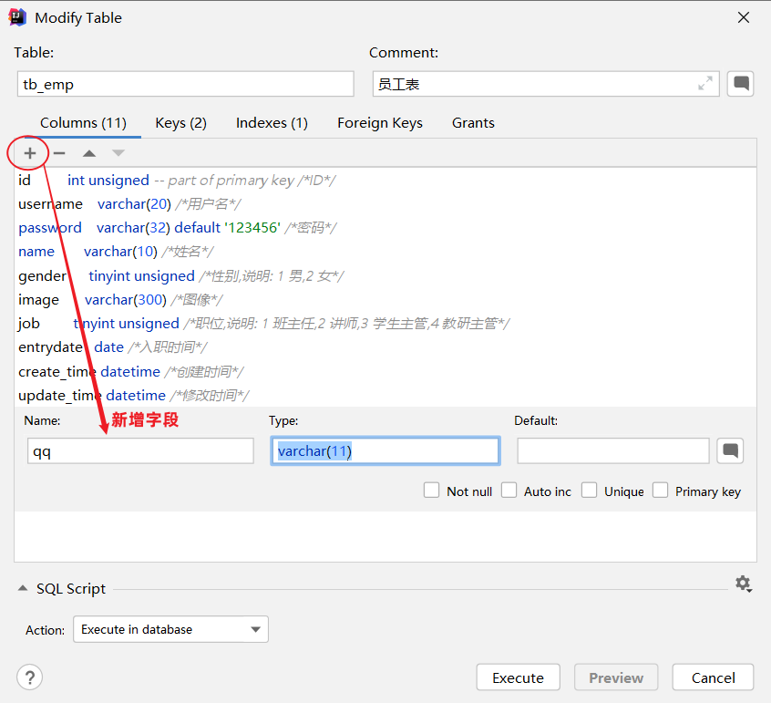


**修改数据类型**

```mysql
alter table 表名 modify  字段名  新数据类型(长度);
```

```sql
alter table 表名 change  旧字段名  新字段名  类型(长度)  [comment 注释]  [约束];
```

案例：修改qq字段的字段类型，将其长度由11修改为13

```sql
alter table tb_emp modify qq varchar(13) comment 'QQ号码';
```

案例：修改qq字段名为 qq_num，字段类型varchar(13)

```sql
alter table tb_emp change qq qq_num varchar(13) comment 'QQ号码';
```

> 图形化操作：修改数据类型和字段名

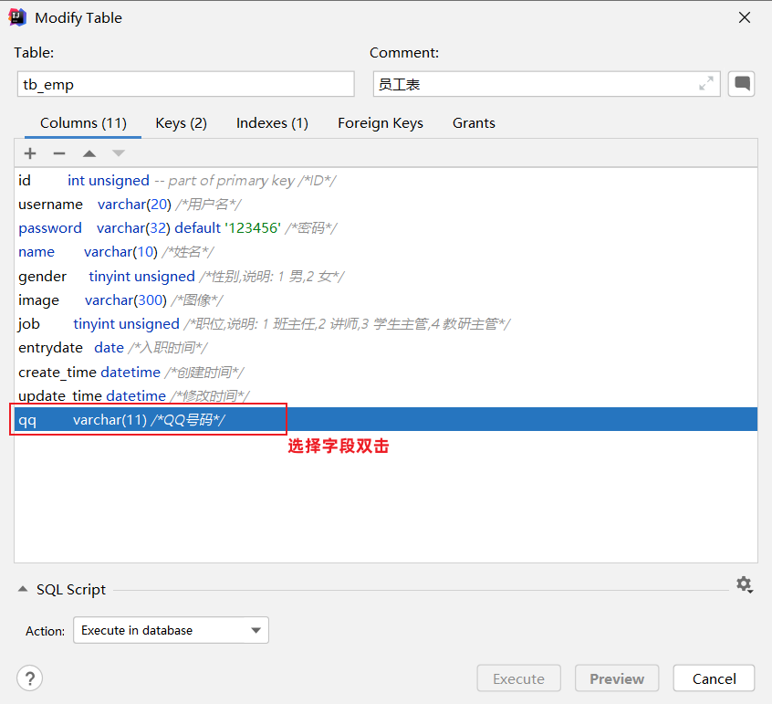

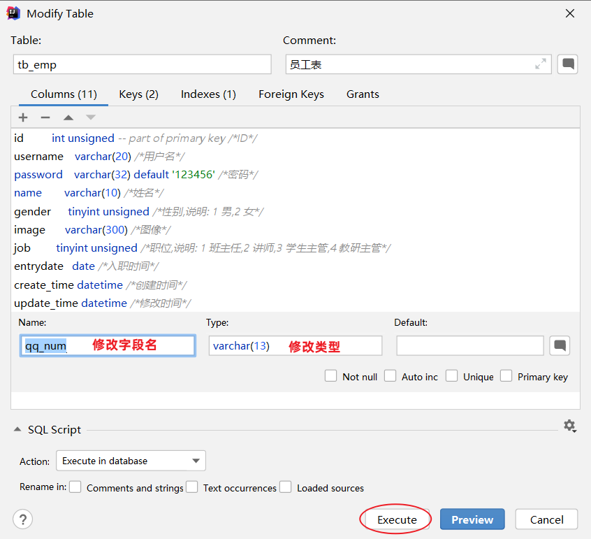


**删除字段**

```sql
alter table 表名 drop 字段名;
```

案例：删除tb_emp表中的qq_num字段

```sql
alter table tb_emp drop qq_num;
```

> 图形化操作：删除字段

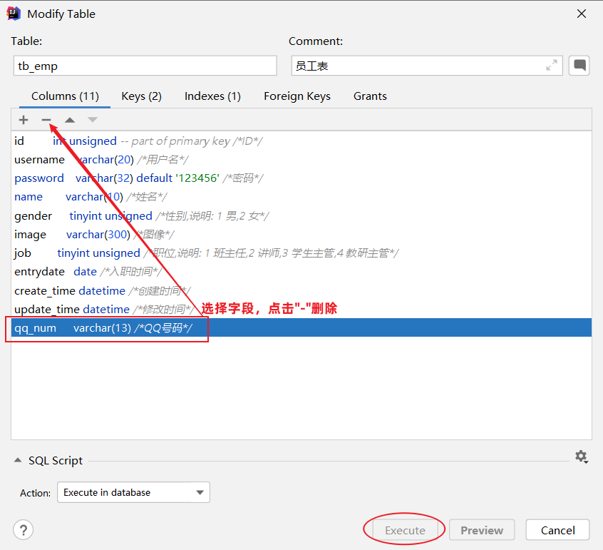


**修改表名**

```sql
rename table 表名 to  新表名;
```

案例：将当前的tb_emp表的表名修改为emp

```mysql
rename table tb_emp to emp;
```

> 图形化操作：修改表名

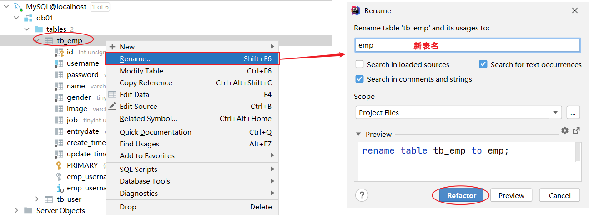


#### 1.3.4 删除

> 关于表结构的删除操作，工作中一般都是直接基于**图形化界面操作**。 

删除表语法：

```sql
drop  table [ if exists ]  表名;
```

> if exists ：只有表名存在时才会删除该表，表名不存在，则不执行删除操作(如果不加该参数项，删除一张不存在的表，执行将会报错)。

案例：如果tb_emp表存在，则删除tb_emp表

~~~mysql
drop table if exists tb_emp;  -- 在删除表时，表中的全部数据也会被删除。
~~~

> 图形化操作：删除表

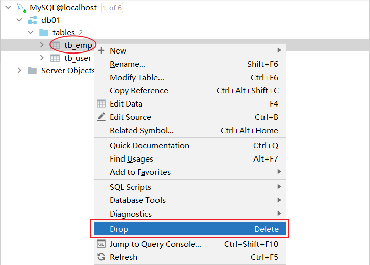 


## 2. 数据库操作-DML

DML英文全称是Data Manipulation Language(数据操作语言)，用来对数据库中表的数据记录进行增、删、改操作。

- 添加数据（INSERT）
- 修改数据（UPDATE）
- 删除数据（DELETE） 

### 2.1 增加(insert)

insert语法：

- 向指定字段添加数据

  ~~~mysql
  insert into 表名 (字段名1, 字段名2) values (值1, 值2);
  ~~~

- 全部字段添加数据

  ~~~mysql
  insert into 表名 values (值1, 值2, ...);
  ~~~

- 批量添加数据（指定字段）

  ~~~mysql
  insert into 表名 (字段名1, 字段名2) values (值1, 值2), (值1, 值2);
  ~~~

- 批量添加数据（全部字段）

  ~~~mysql
  insert into 表名 values (值1, 值2, ...), (值1, 值2, ...);
  ~~~


案例1：向tb_emp表的username、name、gender字段插入数据

~~~mysql
-- 因为设计表时create_time, update_time两个字段不能为NULL，所以也做为要插入的字段
insert into tb_emp(username, name, gender, create_time, update_time)
values ('wuji', '张无忌', 1, now(), now());
~~~

案例2：向tb_emp表的所有字段插入数据

~~~mysql
insert into tb_emp(id, username, password, name, gender, image, job, entrydate, create_time, update_time)
values (null, 'zhirou', '123', '周芷若', 2, '1.jpg', 1, '2010-01-01', now(), now());
~~~

案例3：批量向tb_emp表的username、name、gender字段插入数据

~~~mysql
insert into tb_emp(username, name, gender, create_time, update_time)
values ('weifuwang', '韦一笑', 1, now(), now()),
       ('fengzi', '张三疯', 1, now(), now());
~~~

> 图形化操作：双击tb_emp表查看数据

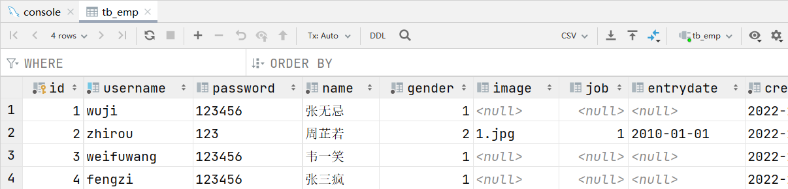

Insert操作的注意事项：

1. 插入数据时，指定的字段顺序需要与值的顺序是一一对应的。

2. 字符串和日期型数据应该包含在引号中。

3. 插入的数据大小，应该在字段的规定范围内。


### 2.2 修改(update)

update语法：

```sql
update 表名 set 字段名1 = 值1 , 字段名2 = 值2 , .... [where 条件] ;
```

案例1：将tb_emp表中id为1的员工，姓名name字段更新为'张三'

```sql
update tb_emp set name='张三',update_time=now() where id=1;
```

案例2：将tb_emp表的所有员工入职日期更新为'2010-01-01'

```sql
update tb_emp set entrydate='2010-01-01',update_time=now();
```

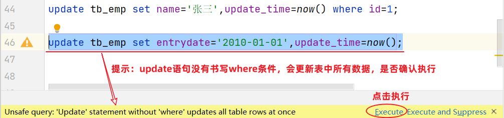

> 注意事项:
>
> 1. 修改语句的条件可以有，也可以没有，如果没有条件，则会修改整张表的所有数据。
>
> 2. 在修改数据时，一般需要同时修改公共字段update_time，将其修改为当前操作时间。


### 2.3 删除(delete)

delete语法：

```SQL
delete from 表名  [where  条件] ;
```

案例1：删除tb_emp表中id为1的员工

```sql
delete from tb_emp where id = 1;
```

案例2：删除tb_emp表中所有员工

```sql
delete from tb_emp;
```

> 注意事项:
>
> ​	• DELETE 语句的条件可以有，也可以没有，如果没有条件，则会删除整张表的所有数据。
>
> ​	• DELETE 语句不能删除某一个字段的值(可以使用UPDATE，将该字段值置为NULL即可)。
>
> ​	• 当进行删除全部数据操作时，会提示询问是否确认删除所有数据，直接点击Execute即可。 


